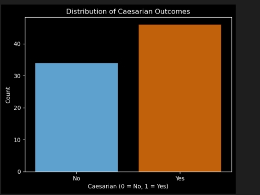
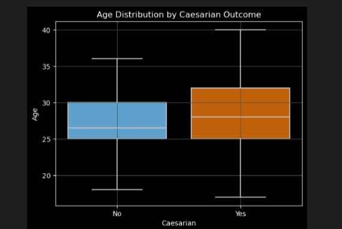
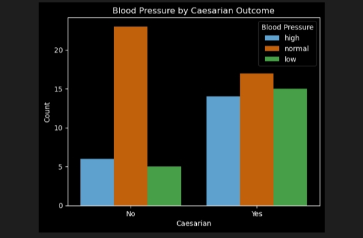
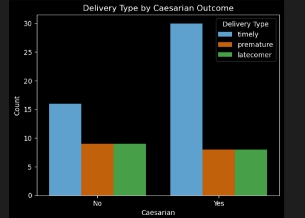
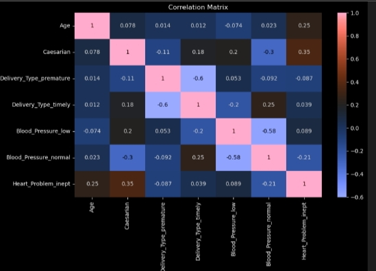

# CAESARIAN-SECTION-PREDICTION-USING-LOGISTIC-REGRESSION

## 📑 TABLE OF CONTENTS

[Project Overview](#-project-overview)  

[Description](#-description)  

[Problem Statement](#-problem-statement) 

[Project Objective](#-project-objective)  

[Key Areas Analyzed](#-key-areas-analyzed)  

[Data Source](#-data-source)  

[Dataset Description](#-dataset-description)  

[Tools](#-tools)  

[Methodology](#-methodology)  

[Data Cleaning](#-data-cleaning)  

[Summary Statistics Interpretation](#-summary-statistics-interpretation)  

[Visual Insights](#-visual-insights)  

[Multicollinearity Check (VIF)]()  

[Logistic Regression Model](#-logistic-regression-model)  

[Predictors Interpretation](#-predictors-interpretation)  

[Model Evaluation](#-model-evaluation)  

[Recommendation](#-recommendation)  

[Acknowledgement](#-acknowledgement)  

[Contact](#-contact)

## 📖 PROJECT OVERVIEW
This project applies **logistic regression** to predict whether a woman will undergo a **Caesarean Section (CS)** based on features such as age, blood pressure, delivery type, and heart condition. The goal is to identify significant predictors that influence CS delivery decisions using statistical and visual analysis.

## 🔍 DESCRIPTION
Caesarean deliveries are critical for managing high-risk pregnancies but can be overused if not guided by evidence. Predicting CS risk helps clinicians tailor care and avoid unnecessary procedures.

## ❓ PROBLEM STATEMENT
Health professionals lack predictive insights into CS risk, leading to under- or over-utilization. Early predictions can assist in planning safer delivery options for mothers.

## 🎯 PROJECT OBJECTIVE
This project aims to:

✅ Analyze medical and delivery-related features influencing CS delivery

✅ Build a logistic regression model to predict CS occurrence

✅ Identify significant predictors using statistical tests

✅ Support better maternal healthcare decisions with data

## 🔍 KEY AREAS ANALYZED
📌 Caesarean distribution by blood pressure, age and delivery type

📌 Feature correlation using heatmaps 

📌 Significant predictors via logistic regression 

📌 Performance evaluation (accuracy, AUC)

## 📊 DATA SOURCE
The data was obtained from kaggle website 

Here's the link to the dataset: [Kaggle - Caesarian Section Classification Data](https://www.kaggle.com/datasets/rashikrahmanpritom/caesarian-section-classification)

## 📂 Dataset Description
Dataset: Caesarean Section Classification  

Records: 80 patient cases  
  

| Column             | Description                           |
|--------------------|---------------------------------------|
| Age                | Mother's age                          |
| Delivery Type      | Timely or Premature                   |
| Blood Pressure     | Normal, High, or Low                  |
| Heart Problem      | Yes or No                             |
| Caesarian          | Target variable (Yes or No)           |

## ⚒️ Tools Used
 **Python**(**Pandas**, **Seaborn**, **Matplotlib**
**Statsmodels**, **Scikit-learn**)

## 📒 Methodology
1️⃣ Load and clean dataset  

2️⃣ Standardize and encode variables  

3️⃣ Perform exploratory data analysis  

4️⃣ Check multicollinearity using VIF  

5️⃣ Train logistic regression model  

6️⃣ Interpret model coefficients  

7️⃣ Evaluate model performance

## 🧹 Data Cleaning
✅ Renamed and standardized columns  

✅ Encoded categorical variables (e.g., Caesarian 0/1)  

✅ Verified **no missing** or duplicate values  

✅ Converted boolean features to integers  

✅ Dropped redundant **Delivey No** column

## 🧮 Summary Statistics Interpretation

| Statistic | Age |
|-----------|-----|
| Mean      | 27.7 |
| Median    | 27   |
| Std Dev   | 5.0 |
| Min–Max   | 17–40 |

Majority of patients were in their late 20s to early 30s, common childbearing age group. The dataset provides a good age range for modeling.

## 📊 Statistical Insights and Data Visualization
In this section, we explore the relationship between patient characteristics and Caesarean section outcomes through several visualizations.

### 📊 Target Distribution

- **Yes (CS delivery)**: 46  
- **No**: 34  

Majority of deliveries resulted in Caesarean Sections (58%).

### 📊 Age Distribution by Caesarian Section 

- **Higher age** slightly associated with CS

### 📊 Blood Pressure by Caesarian Section 

- Most CS deliveries occurred among women with **normal blood pressure**.
  
- Fewer CS cases were seen in **low and high BP groups**.

### 📊 Delivery Type by Caesarian Section 

- More CS deliveries occurred in the **timely delivery group** than in the **premature group**.

## 🧮 Multicollinearity Check (VIF)

To ensure the logistic regression model is free from multicollinearity (highly correlated predictors), the **Variance Inflation Factor (VIF)** was calculated for each independent feature.

### **Rule of Thumb**:
  - **VIF < 5** → No multicollinearity concern  
  - **VIF 5–10** → Moderate concern  
  - **VIF > 10** → High multicollinearity (problematic)
    
### 📊 VIF Table

| Feature                  | VIF       |
|--------------------------|-----------|
| Age                      | 1.08      |
| Delivery_Type_premature  | 1.60      |
| Delivery_Type_timely     | 1.70      |
| Blood_Pressure_low       | 1.52      |
| Blood_Pressure_normal    | 1.61      |
| Heart_Problem_inept      | 1.14      |

### ✅ Interpretation
All the features in this model have **VIFs well below 2**, indicating **no multicollinearity issue**.

✅ The logistic regression model is stable, and the predictor coefficients are interpretable and reliable.

### 🔄 Correlation Matrix and Multicollinearity
The correlation heatmap helps identify **linear relationships** between independent variables. High correlation between predictors (typically above **0.8 or below –0.8**) can signal **multicollinearity**, which can distort regression model estimates.

### ✅ Interpretation:

- **No strong correlation (> 0.8)** was observed between any pair of independent variables.
- Most feature correlations were **weak to moderate** (ranging between **–0.3 and +0.4**).
- This suggests that the predictors are **not linearly dependent** on each other.

 ✅ **Conclusion**: The correlation matrix confirms that **multicollinearity is not present**, which supports the validity of using logistic regression. This is consistent with the results from the **Variance Inflation Factor (VIF)** analysis,where all VIFs were **< 2**.

## 📊 Logistic Regression Coefficient Summary

The table below shows the logistic regression results, including coefficients, standard errors, z-values, p-values, and 95% confidence intervals for each predictor.

### Model Formula:

log(p / (1 - p)) = β0 + β1*Age + β2*Delivery_Type + β3*Blood_Pressure + β4*Heart_Problem

### 🔢 Regression Output Table
 Predictor                | Coefficient (β) | p-value | 95% Confidence Interval | Significant |
|--------------------------|-----------------|---------|--------------------------|--------------|
| Age                      | +0.0095         | 0.859   | [–0.095, +0.114]         | ❌ No         |
| Delivery_Type_premature  | +0.4224         | 0.601   | [–1.160, +2.005]         | ❌ No         |
| Delivery_Type_timely     | +1.5988         | 0.031   | [+0.145, +3.052]         | ✅ Yes        |
| Blood_Pressure_low       | +0.4637         | 0.553   | [–1.068, +1.995]         | ❌ No         |
| Blood_Pressure_normal    | –1.3993         | 0.045   | [–2.769, –0.030]         | ✅ Yes        |
| Heart_Problem_inept      | +1.4643         | 0.013   | [+0.303, +2.626]         | ✅ Yes        |

## Predictors Interpretation

- **Delivery_Type_timely**  

  Patients with timely delivery were **~5x more likely** to have CS.
  
- **Blood_Pressure_normal**  

   Having **normal BP** **reduced odds** of CS by ~75% compared to high BP
- **Heart_Problem_inept**  

  Presence of heart condition **increased CS risk** by over 4x
  
- **Age** and **BP Low** were not statistically significant in this dataset.
  
  ## 📏 Model Evaluation

The performance of the logistic regression model was assessed using classification metrics and ROC AUC score.

### 📊 Evaluation Metrics

| Metric              | Value   |
|---------------------|---------|
| **Accuracy**        | 68.75%  |
| **Precision (Yes)** | 69%     |
| **Recall (Yes)**    | 90%     |
| **F1 Score (Yes)**  | 78%     |
| **ROC AUC Score**   | 0.725   |

### ✅ Interpretation

- **Accuracy (68.75%)**: The model correctly predicted ~69% of all outcomes.

- **Recall (90%)**: The model was excellent at identifying actual CS cases — a crucial metric in healthcare where missing a positive case can be costly.

- **Precision (69%)**: Of all cases predicted as CS, 69% were correct.

- **F1 Score (78%)**: Good balance between precision and recall.

- **ROC AUC Score (0.725)**: Indicates fair discriminative ability — the model can distinguish between CS and non-CS cases about 73% of the time.

> ✅ **Conclusion**: The model is well-calibrated for early identification of patients likely to undergo Caesarean delivery, with strong recall and acceptable overall performance.

## ✅ Recommendations

1️⃣ **Integrate Model into Early Screening**: Flag patients with heart issues and high BP for closer monitoring.

2️⃣ **Reevaluate Timely Delivery Patterns**: Investigate why CS rates are high even for timely deliveries consider delivery context or doctor preference.

3️⃣ **Train Staff on Risk Factors**: Ensure clinicians understand the predictors of CS and the value of predictive tools in planning interventions.

4️⃣ **Expand Data for Stronger Modeling**: Larger datasets may uncover more significant relationships, especially for non-significant features like age.

## 🙏 Acknowledgement

This project is made possible using publicly available data from **Kaggle**.  
Special thanks to the dataset contributors for sharing valuable health-related data that supports learning and research in maternal care and predictive modeling.

This project is for educational and portfolio purposes only.

## 📞 Contact

Created by **Ajirola Amudat**  
🔗 [LinkedIn](https://www.linkedin.com/in/ajirolaamudat)

📫 For questions or collaborations: [Send a message](https://www.linkedin.com/in/ajirolaamudat)

  

